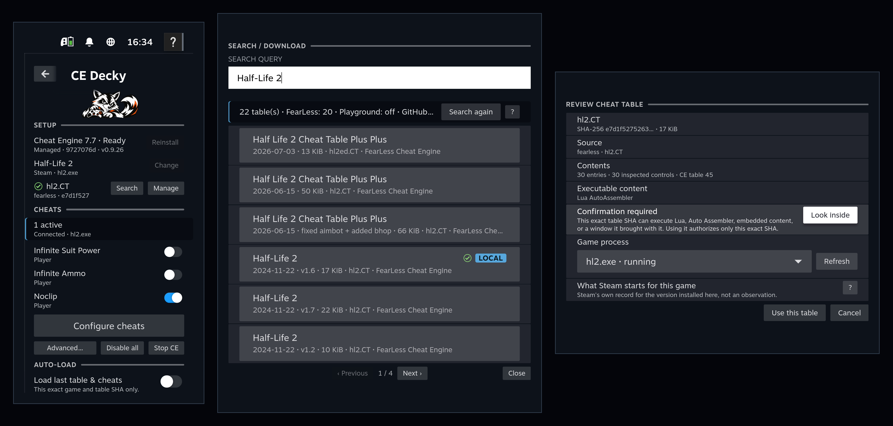

# CE Decky

Use Cheat Engine tables on SteamOS, from the controller, without leaving Game Mode.


CE Decky is a [Decky Loader](https://github.com/SteamDeckHomebrew/decky-loader) plugin. It downloads and installs Cheat Engine for you, finds a table for the game you are playing, and puts that table's cheats in the Quick Access Menu as ordinary toggles. Cheat Engine runs inside the running game's own Proton environment; you never see its Windows interface, and nothing about the workflow needs Desktop Mode, a terminal, or a file manager.<br clear="right">



## Highlights

- **Nothing to install by hand.** One press downloads the official Cheat Engine installer, checks it against a pinned size and SHA-256, and unpacks it into the plugin's own storage. No installer runs, no extra Proton prefix is created, and no Cheat Engine code ships in this repository.
- **It finds the table.** Search five community catalogs at once, ranked against the name your library actually shows for the game, with the source, post date and claimed version on every result. Or open a `.CT`, `.zip`, `.7z` or `.rar` you already have.
- **Cheats become toggles.** Pin the ones you use onto the Quick Access panel and flip them mid-game with the controller. `Disable all` switches everything off without stopping Cheat Engine.
- **It attaches to the game you are already playing.** Cheat Engine starts in that game's own Proton environment, on its display, as a process the plugin owns, and stopping it leaves the game running.
- **Set it up before you play.** Configure cheats with nothing running at all; the choices are saved for that exact table and applied the moment Cheat Engine starts.
- **Scripts are handled for you.** Switching on a cheat that lives inside a script switches on the scripts it needs first, outermost first, instead of failing and naming a parent for you to go find.
- **It remembers.** Auto-load brings back the same table and the same cheats for that exact game, so the second session is one press instead of another search.
- **It remembers what worked.** A cheat that switched on and read back as active marks that exact table as working for that game, and the mark changes when the game updates, so a table you used months ago says whether it is worth retesting instead of leaving you to guess.
- **Every table is authorized on purpose.** A table is executable content, so opening one is never permission to run it: you review it and authorize its exact SHA-256, and a changed file is a different table.
- **You can read what a table would run, on the controller.** **Look inside this table** lists everything in it that Cheat Engine can execute and shows any of it as text: its Lua, each cheat's Auto Assembler script under the name of the cheat, and a window the table carries. It reads and runs nothing.
- **All of it works on a controller.** Every step above is reachable from Game Mode. Desktop Mode, a terminal and a file manager are development tools here, never something the workflow asks of you.

## What you need

- A SteamOS device with **Decky Loader 3.2.8 or newer** installed. An older loader still runs and still writes its log, but it does not appear in the Quick Access menu on current Steam, so nothing you install through it is reachable.
- At least one **Proton** version installed (Valve's or a GE build). CE Decky runs Cheat Engine through the same Proton the game is using.
- About **230 MB** free in your home directory: ~35 MB for the cached Cheat Engine installer, ~94 MB for the installed copy, and ~94 MB more once you first start Cheat Engine, because CE Decky launches a private copy instead of modifying the installation. Tables, logs and search caches are small on top of that; the one-off self-test in Advanced also creates its own Proton prefix.
- An internet connection for the first-run Cheat Engine download and for searching tables.

CE Decky is for offline and single-player games. See [What this is not](#what-this-is-not).

## Install

CE Decky is not in the Decky store yet, so install the release ZIP by hand.

1. Download `CE-Decky-v<version>.zip` from [Releases](https://github.com/goooroooX/CE-Decky/releases). Each release also publishes a SHA-256 checksum, so you can verify the file before installing it.
2. In Decky Loader's settings, turn on **Developer mode**, then use its install-from-URL/file action and point it at that ZIP. Decky's own documentation covers this screen.
3. Open the Quick Access Menu (the **…** button) and pick **CE Decky**.

Updating is the same steps with a newer ZIP; Decky replaces the plugin in place and your tables, settings and authorizations are kept.

After the first install CE Decky can do that part itself. When a newer release exists the panel shows an orange **Update to vX.Y.Z** button above everything else; pressing it says which version replaces which, warns that Steam's interface restarts, and, once you confirm, downloads the release, checks it against the checksum published with it, and hands it to Decky to install. The download can be stopped; from the moment Decky starts replacing the plugin it cannot, because the panel is part of what is being replaced.

It only looks when you are actually using the plugin: a check happens after you have searched for a table recently, at most once every few hours, and it is one request that carries nothing about you. **Advanced -> Plugin updates** has a **Check now** press and the switch that turns all of it off; switched off, nothing contacts GitHub and no button appears. If an install fails, the checked release is kept in your home folder and that screen names the exact path, so you can install it by hand from Decky's developer mode without downloading it again.

## First run: install Cheat Engine

The plugin ships no Cheat Engine code. The first panel row says Cheat Engine is not installed and offers **Install**.

Pressing it downloads the official Cheat Engine 7.7 Windows installer from Cheat Engine's own download host, checks its exact size and SHA-256 against a pinned manifest, and extracts it directly into plugin-owned storage. The installer is never executed and no separate Proton prefix is created for setup. The download is resumable and can be cancelled, and progress is shown on the row.

If that artifact ever stops being downloadable, **Advanced… → Fallback** lets you register a Cheat Engine installation you copied from a Windows machine, either as a folder or as a `.zip` of the installation directory. The archive is validated before a byte is written.

## Using it

The panel is three sections: **Setup**, **Cheats**, and **Auto-load**.

### 1. Pick the game

Start the game first. CE Decky follows the running game automatically, so the game row normally fills itself in. **Choose** lets you pick a Steam game or a non-Steam shortcut by hand when nothing is running, which is how you set a game up in advance.

**Change** is greyed out while the game it is on is running. Everything CE Decky holds is per game: the table you selected, the process it attaches to, the authorization you gave that exact table, and any Cheat Engine it is running for you. So you change the game with nothing running - quit the game and the press comes back.

### 2. Get a table

On the table row:

- **Search** looks the game up on FearLess Cheat Engine, Playground, GitHub, The Cheat Script and VGTimes, ranked against the name your library shows and, among equally plain matches, newest first. Results say where they came from, when they were posted and which version they claim. Some sources make a guest wait before handing over a file; CE Decky sits out that countdown in a window you can cancel, rather than appearing to hang.
- Any of those five sources can be switched off under **Advanced… → Table sources**, and search then says which ones it did not ask.
- **Manage** is everything that is not an online search: your own library, opening a `.CT`, `.zip`, `.7z` or `.rar` you already have, and removing one. The row carries those two presses and no more, because a third does not fit across a 300 pixel panel beside a filename.

When a cheat refuses to switch on, CE Decky asks whether to stop using that table; nothing is recorded until you answer. A table you stop using is greyed out in every later search and carries a red mark wherever it appears, so you do not download it twice, and it stops being offered for use until you say otherwise. **Retry N** above the results clears those marks when a game update makes them worth another try, and **Advanced… → Tables that did not work** is the full list.

Downloading or opening a table brings up **Review cheat table**: what the table contains, how many records it has, whether it carries Lua, Auto Assembler code, a window of its own or an embedded file, and which process it expects. This is where you decide.

**Opening a table is not permission to run it.** A table is executable content, and CE Decky stores it by its exact SHA-256 and asks you to authorize that exact file. Change the file and the authorization no longer applies.

**Look inside this table**, on that same screen, is how you answer that question instead of taking it on trust. It lists everything in the table Cheat Engine can execute and shows any of it as plain text, a page at a time: its Lua, each cheat's Auto Assembler script, and a window the table carries. An embedded file is named and sized rather than opened. Nothing here runs, and anything shortened or cleaned up for display says so on screen. The same view is under **Advanced… → Active table → Look inside** for the table you are already using.

#### What the marks on a table mean

Search and Manage put small round marks beside a table. One says whether that exact table has been shown to work for that game, and it is a mark rather than a word so a row stays one line and one press on a controller.

| Mark | What it means |
|---|---|
| Green check in a solid ring | A cheat from this table switched on and read back as active for this game, and the game still looks like the build that happened on. |
| Amber arrow | It worked before, but the game's version or Steam build has changed since, or you cleared a not-working mark. Worth retesting, and nothing is known to be broken until you try. |
| Green check in a dashed ring | It worked, and nothing here could compare the build it worked on with the one in front of you - which is what a table another game on this device proved looks like. The same success, without that one comparison. |
| Red cross | This exact table was tried and recorded as not working. The file stays on your device, but choosing it for a game is refused everywhere until you clear the mark. A game already using it is left alone. |

Red outranks the others: while it stands nothing shows green, and clearing it does not bring an old green back, because only a cheat that works again can say the table works again. **Retry N** in search clears the marks the rows in front of you are showing, and **Advanced… → Tables that did not work** is the full list; clearing a mark makes that table usable again everywhere at once. A source that is offering a newer file than the copy you already have is the one case the row cannot show both of: open that row and the window names the two apart, with its own **Retry** beside the download it is refusing. The recorded reason behind a red mark is written out in **Manage** and in that same Advanced list.

The green and amber marks are about one game: the same table can be proven on one game and carry the dashed ring on another. Red is about the bytes rather than about a game, so a table you recorded as not working is marked in every game's search until you clear it.

A second, neutral mark of two overlapping sheets means the exact same table bytes are already known from another source. It is why a result you never downloaded yourself can already say **Local**.

**Local** and **Imported** answer a different question: whether the bytes are on this device, not whether the table works. **Local** means the exact table is here and can be used with no network at all. **Imported** is weaker and means only that you have downloaded from this row before: what it served then is not what this device holds for this game now, either because the file has been deleted or because the source has since published different bytes, so using it still costs a download. A table marked as not working is still **Local**, because the file is still here and nothing deleted it; what the mark costs you is the press that uses that copy, until you clear it. **Gone**, **Encrypted**, **Not a table** and **Damaged** are about the source or about the file: a download nobody could open never failed at anything, and none of them say the table is wrong for your game.

#### Your table library

**Manage**, beside Search on the table row, is every table on this device rather than only this game's: which games hold each one, which are free to delete, and the tables another game brought in. It opens with no game selected at all, so a library can be tidied up before anything is running.

- **Local file**, under **Open a file**, imports a table you already have. It needs no game: the file joins this device's library and waits there for you to pick a game and press **Use**, which is where it is authorized.
- **Use** picks a table for the game you have selected, and is absent when there is no game to pick it for. It is off for a table you marked as not working, with the row saying so, until you clear the mark.
- **Revoke** detaches a table from the games holding it: the authorization and automatic startup for those games go, the file and your library history stay, and the table can be selected again later. It is also how a table held by a game you have since removed from Steam is freed.
- **Delete** removes the bytes from this device, for every game that kept them, once nothing holds them.


### 3. Configure the cheats

**Configure cheats** lists the table's controls, one per row, with an **Active** toggle. **More** on a row reveals its value editor, the option to pin it, and its raw record ID.

- You can do this with the game running or with nothing running at all. Configured with nothing running, your choices are saved for that exact table and applied the next time Cheat Engine starts.
- Switching on a cheat that lives inside a script switches on the scripts it needs first: a record inside a script has no address until that script has run.
- **Pin** promotes a control onto the main panel as a live toggle, so the cheats you actually use are one press away.
- A cheat that chooses from a list offers that list on the row. Some tables declare thousands of items in one, so past a screenful there is a **Find a value** box above it: type part of the name or the number and the list narrows to what matches. Only values the table itself declares are ever offered.
- Scripts the table uses to build its cheats are hidden behind the **Scripts** toggle in the header; CE Decky manages them for you.

### 4. Start Cheat Engine

With the game running, **Load table & start CE** starts Cheat Engine in that game's Proton environment and attaches it to the game. If it cannot start, the row underneath names the exact reason: the game is not running, the table is not authorized yet, the target process is not confirmed, or the game is up and running something other than the program this table is for - which names what it did start, so **Advanced… → Target process** has something to set it from.

Cheat Engine takes the foreground as it starts, so some games dip out for a moment and are asked straight back.

Once connected, the Cheats section shows the live state and your pinned toggles work directly from the panel. **Disable all** switches every active cheat off without stopping Cheat Engine. **Stop CE** ends the Cheat Engine session and leaves the game running.

### 5. Next time

Turn on **Load last table & cheats** and the next session restores the same table and the same choices for that exact game and table, without going through search again. Switching off the last cheat you had saved for a table switches auto-load off with it, so it never starts Cheat Engine for a table with nothing left to apply.

## Where your data lives

Everything CE Decky creates is under `~/.cheat-engine-decky/`:

| Directory | What it holds |
|---|---|
| `ce/` | the installed Cheat Engine, its cached installer, and the private runtime copy actually launched |
| `tables/` | every table you imported, stored by its SHA-256, with where it came from |
| `state/` | per-game profiles: selected table, authorization, target process, cheat choices, and which table sources you switched off |
| `cache/` | provider search indexes and diagnostics |
| `tmp/` | staging for downloads and imports |

Settings and logs live in Decky's own directories. **Advanced… → Plugin data on disk** lists all of it with sizes and explains what each directory is for.

Removing the plugin through Decky deliberately leaves this directory alone, so your tables and authorizations survive an update or a reinstall. Delete `~/.cheat-engine-decky/` yourself if you want it gone.

## Advanced and troubleshooting

**Advanced…** opens with the two things that are settings rather than diagnostics, and everything under them is diagnostics:

- **Plugin updates**: whether CE Decky checks for its own updates, a **Check now**, and the same update press as the panel. A check that failed says so rather than reading as up to date.
- **Panel appearance**: whether the mascot is drawn on the panel. On by default, and switching it off gives that height back to the cheats. The choice survives an update and a reinstall.
- **Table sources**: the five sites search asks, each with what it has actually done on this device. All of them are on to begin with; switching one off stops it completely, and switching it back on costs nothing. Tables you already downloaded are unaffected either way.
- **Registered Cheat Engine** and **Target process**: what is registered, and the exact game `.exe` Cheat Engine attaches to, overridable when the automatic choice picks a launcher instead of the game.
- **Proton and prefix**: the Proton build the game is actually running under, its compatibility data directory, the game's Wine prefix, and the Windows executables observed inside it. An attached start depends on all of these.
- **Active table**: where the table came from, when, where it is stored, and whether it is authorized. **Look inside** opens the same read-only view of everything the table can execute that Review offers. The source page opens in the Steam browser.
- **Runtime**: the current session, the attached process, and what the in-game bridge last reported, including whether a game that was pushed aside could be asked back.
- **Processes**: pick a different Windows process to attach to when the automatic choice was wrong. With Cheat Engine running it asks Cheat Engine what it can see; without it, it reads the game's own processes, which is the case where Cheat Engine will not start or will not attach.
- **Debug details**: the backend's own snapshot: uptime, storage counts, per-provider state, the table-search index, session inventory and the log path.
- **Report a problem**: collects everything needed for a bug report into one file. See below.

If a press fails, a window says what failed and keeps the backend's own detail on a second row, so it is still there to copy into a bug report instead of sliding away on a notification timer. Something that retried by itself, with no press behind it, still reports where it always did rather than opening a window over your game. The backend log path is in **Debug details**.

## Reporting a bug

**Please report bugs this way.** It takes one press and it saves a round of questions.

1. Reproduce the problem, so the logs describe it.
2. Open **Advanced… → Report a problem → Collect**.
3. A dialog gives you the path of the archive it wrote, which is a `ce-decky-support-<version>-<date>.zip` in your home folder (`/home/deck` on a Steam Deck). Note it down and press **OK**.
4. Copy that file off the device: Desktop Mode, or whatever file transfer you already use.
5. Open an issue on this repository, attach the archive, and say what you were doing and what you expected. If the problem is something you can see, attach a screenshot too. Steam takes it with its own screenshot shortcut, **STEAM + R1** on a Steam Deck and possibly another chord on a different controller. The shot goes into Steam's screenshot library rather than a folder you can browse, so to get a file you can attach, turn on **Settings -> In Game -> Save an uncompressed copy** and set the folder beside it; screenshots then also arrive there as ordinary files, for example `~/Pictures/Screenshots`.

The archive contains what nobody can ask you to find by hand from Game Mode:

| Inside the archive | What it answers |
|---|---|
| `summary.txt` | versions, the registered Cheat Engine, self-test result and every configured game, at a glance |
| `logs/plugin/` | CE Decky's own backend log, across every plugin load rather than only the current one |
| `logs/ce-launch/` | what Proton and Cheat Engine actually printed, per game, for a launch that never connected |
| `logs/frontend.json` | what the panel did: which screen, which press, which failure |
| `diagnostics/` | backend state snapshots, the self-test, the live runtime and launch capability, and the environment |
| `state/` | your settings, game profiles, and the session records naming the exact table and target a Cheat Engine was given |
| `tables/` | the cheat tables your games are currently using, which is the only way a parsing or loading report can be answered |
| `manifest.json` | everything that could **not** be collected, with the reason |

It contains no password you typed, no Cheat Engine binary, no installer and no game file. It does contain the names and AppIDs of the games you configured, the paths on your device, and your cheat tables. `README.txt` inside the archive says the same thing. Delete anything you would rather not publish before attaching it; the rest still reads.

Only the five newest archives are kept, so pressing **Collect** repeatedly while narrowing a problem down will not fill your home folder.

## Limitations

Being specific is more useful than being reassuring:

- **CE Decky runs the cheats a table already contains, and nothing else.** Cheat Engine's own interface is never shown, so there is no memory scanning, no pointer scan, no editing a table and no writing a new one from the panel. If the table you found does not have the cheat you want, CE Decky cannot make it.
- **A table is bound to its exact bytes.** A newer revision of the same table is a different table: it is imported, reviewed and authorized separately, and your saved cheat choices do not carry across.
- **A very large table cannot be switched on the fly.** Changing a cheat while the game runs means reading the whole table back to confirm the change took effect, and past a certain size that read cannot finish. Such a table still works: you pick its cheats and values in the panel, and they are applied when Cheat Engine starts. The panel says live controls are unavailable for a table that size, rather than looking like Cheat Engine failed.
- **The game list leaves out what is not a game.** A Steam library belongs to an account, and a device's copy of it is full of things nothing can be cheated in: Proton builds, the Steam Linux Runtimes, Steamworks Common Redistributables under whatever language your Steam is in, and the desktop applications you once added to Steam yourself. Those are dropped on Steam's own record rather than by name - an installed app Steam types as a tool and declares no Windows program for, and a shortcut Steam made out of an application's own `.desktop` entry. The cost is that a game you added from its own `.desktop` entry, which is what a flatpak game is, is hidden the same way, and there is no way to bring a hidden entry back yet.
- **A game with no Windows build has nothing to attach to.** A native Linux game runs under the Steam Linux Runtime, which is a compatibility tool but not a Proton one. Force a Proton compatibility tool for that game in Steam and it will run its Windows build, which CE Decky can attach to.
- **A standalone trainer file is not a table.** A `.CETRAINER` exists to run what it carries without anyone reading it first, which is the opposite of authorizing exact bytes you have seen, so a download that turns out to be one is refused rather than run. When it happens, look for a plain `.CT` in the same post.
- **An encrypted archive cannot be used.** A `.7z` or `.rar` whose files are encrypted is refused with the reason rather than half-imported. A password published beside a provider download is handled; one you would have to type is not.
- **Starting Cheat Engine can push a game aside for a moment.** Some games, mostly older ones, minimize themselves when Cheat Engine takes the foreground. CE Decky asks such a game straight back, so what you see is a dip rather than a black screen. A game that stays dark or slow afterwards is a bug worth reporting with a support bundle.
- **Running Cheat Engine alongside a game costs something, and most of it is Cheat Engine itself.** On a Valve Steam Machine (6 cores, 12 threads), with a demanding game holding a steady 39.5 fps and a 142-record table, an attached session costs about 6.6% of one core: Cheat Engine 4.7%, 1.5 points on the game's `wineserver`, and CE Decky's own backend 0.3%. The frame rate does not move. On a Steam Deck LCD (4 cores, 8 threads) with the same game and table and no power limit, about 13.3% of one core: Cheat Engine 9.4%, 3.3 points on `wineserver`, and the backend 0.6%. None of that is free on a device that has nothing to spare: where a game is already at the limit of what its handheld can do, the cost comes out of frames rather than out of headroom, so closing Cheat Engine when you are not using it is the lever.

## What this is not

- CE Decky is for offline and single-player use.
- It never writes Steam launch options and never edits your live Steam configuration. It reads your library to identify a game, and that is all.
- It does not disable, bypass, evade or hide from anti-cheat systems, and it will not help you do that.
- No Cheat Engine binary or source is contained in this repository or in any release ZIP. Cheat Engine is downloaded from its official host, on your explicit action, and verified against a pinned checksum.
- No community table is redistributed here. Tables are downloaded from their own sources or opened from your device.
- CE Decky is an independent project. It is not affiliated with or endorsed by Cheat Engine, Valve or any table author.

## Development

The whole validation control plane is one portable Python command. It detects what changed, runs only the checks that cover it, keeps full logs under ignored `build/qa/`, and prints an exact rerun command when something fails:

```bash
python scripts/qa.py --bootstrap
python scripts/qa.py
```

`--bootstrap` restores only what the selected profile needs and is unnecessary while the lock files are unchanged. Documentation and backend work need only Python; frontend changes also need Node, because the plugin bundle is built with Decky's pinned official Rollup toolchain.

Run the full gate once after focused iteration. It builds the plugin package too, and a stage whose inputs have not changed since it passed is reused rather than run again:

```bash
python scripts/qa.py --profile release
```

The full backend suite exercises POSIX executables, symlinks and Wine paths, so GitHub Actions on Linux is the authoritative gate, and a green local run on another OS does not clear it.

| Path | Purpose |
|---|---|
| `src/` | Decky frontend, TypeScript and React |
| `py_modules/ce_decky/` | Python backend |
| `tests/` | production tests |
| `dist/` | checked-in frontend bundle used by the plugin package |
| `docs/` | design, architecture, security and development contracts |
| `scripts/` | build, test, packaging and verification helpers |

[AGENTS.md](AGENTS.md) is the working contract for contributors and coding agents; [docs/README.md](docs/README.md) maps the longer documents. Releases are built by GitHub Actions from a reviewed `v<version>` tag: the workflow checks the tag against `package.json` and `CHANGELOG.md`, runs the validation suite, builds the deterministic plugin ZIP, writes its checksum, and attests the archive. Source authority is the reviewed repository tag.

## License

CE Decky is licensed under **GPL-3.0-or-later**. See [LICENSE](LICENSE) and [THIRD_PARTY_NOTICES.md](defaults/THIRD_PARTY_NOTICES.md) for the third-party components included in the plugin package.

## Credits

- **Dmitry Nikolaenya**: concept, architecture, planning, product design, validation, and testing.
- **Claude Opus 5** and **GPT-5.6 Sol**: AI-assisted implementation, code review, bug hunting, test development, and integration.

Development followed an iterative, human-directed workflow with multi-model AI assistance.
